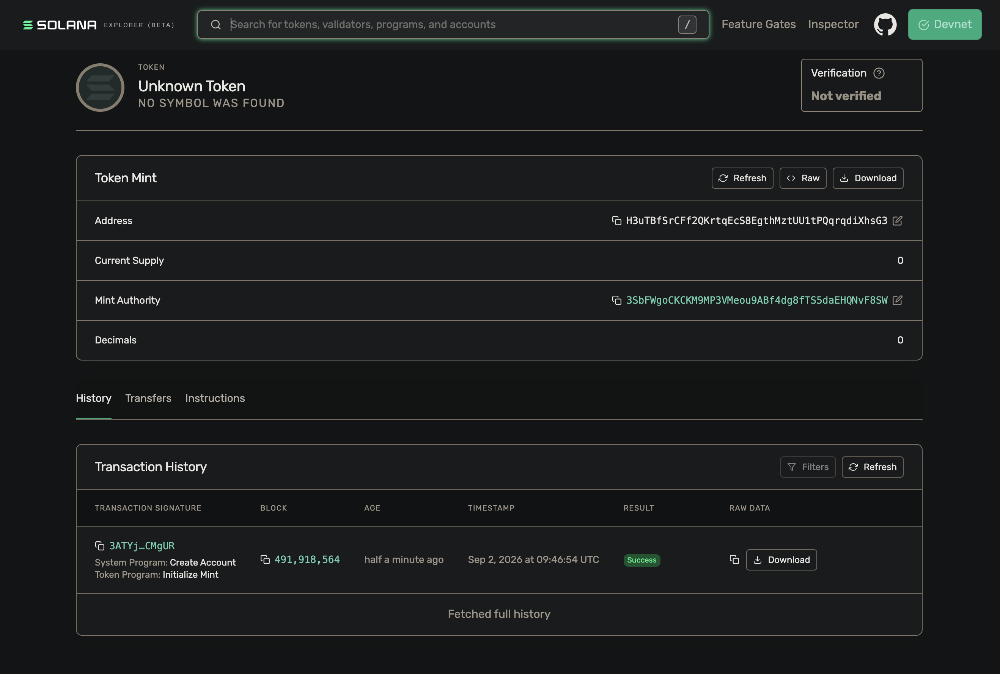
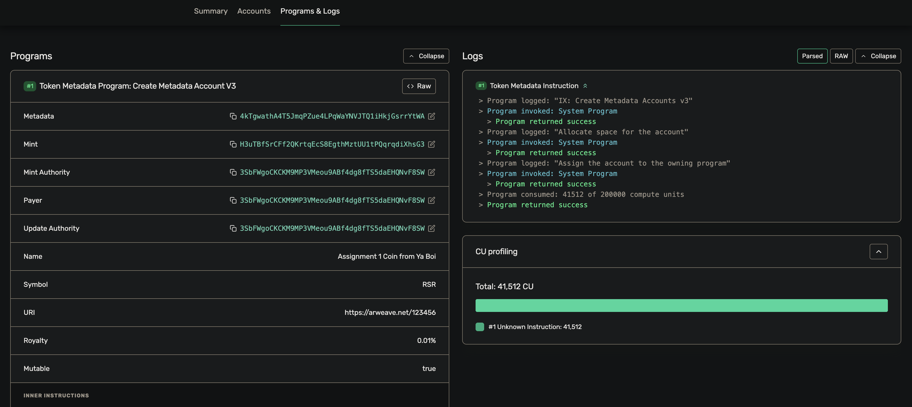
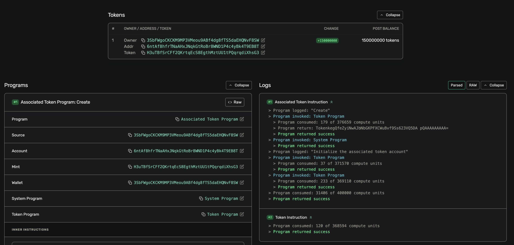
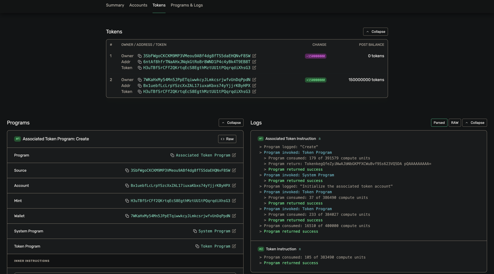
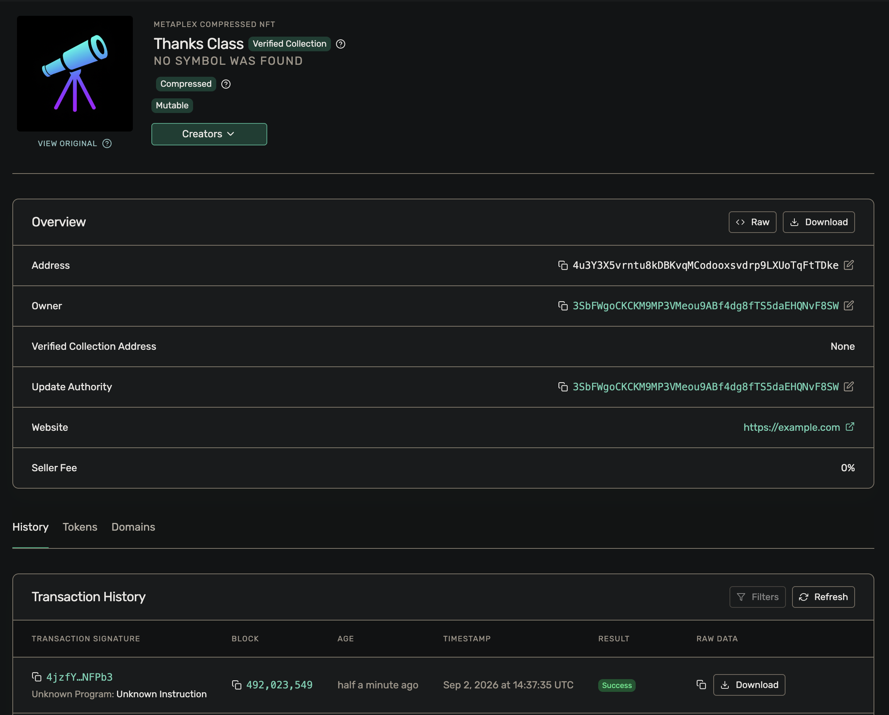
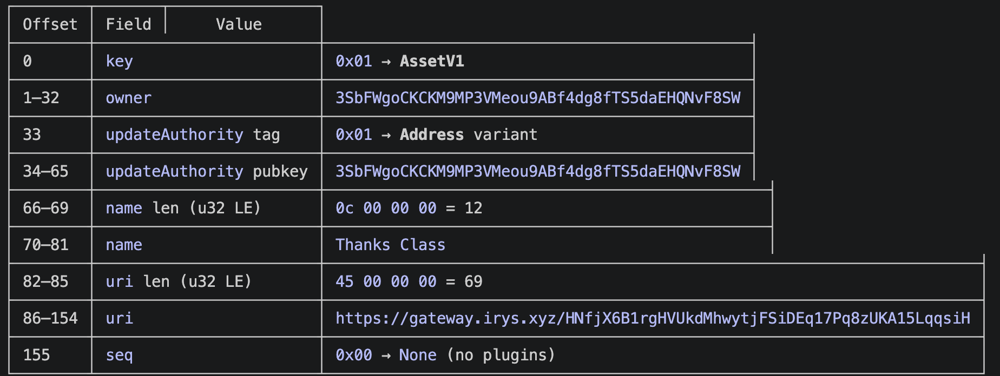
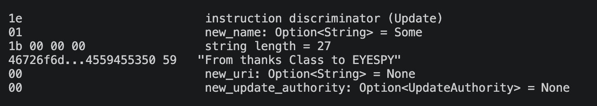
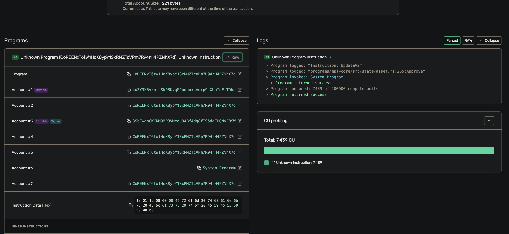

# Assignment 1
## Tasks

1. Mint and transfer your own SPL token.
2. Mint an NFT using MPL Core.
3. Update the NFT's name and metadata as the update authority.

## `src/spl/` — the token

Run these in order. Each one prints an address you paste into the next.

| # | File | What it does, in plain words |
|---|------|------------------------------|
| 1 | `spl_init.ts` | Creates a brand new token (the "mint"). Prints the **mint address**. This token has 0 decimal places. |
| 2 | `spl_metadata.ts` | Gives the token a name, symbol, and image link |
| 3 | `spl_mint.ts` | Makes some coins of your token and puts them in your own account.|
| 4 | `spl_transfer.ts` | Sends some of your coins to another wallet. It also creates the receiver's token account if they don't have one.|

Notes:
- The `decimals` number in `spl_metadata.ts`, `spl_mint.ts`, and `spl_transfer.ts`
  must all match the one used in `spl_init.ts` (currently `0`).
- Amounts are in the smallest unit. With 0 decimals, `150n` just means 150 coins.

---

## `src/nft/` — the NFT

| # | File | What it does, in plain words |
|---|------|------------------------------|
| 1 | `nft_image.ts` | Uploads your picture file to storage (Irys). Prints the **image URI** (a link). Change the file path to point at your own image. |
| 2 | `nft_metadata.ts` | Builds a small JSON file (name, description, image link, traits) and uploads it. Prints the **metadata URI**. Paste the image URI in first. |
| 3 | `nft_mint.ts` | Actually creates the NFT on-chain, pointing at the metadata URI. Prints the **asset address** (the NFT's ID). |
| 4 | `nft_update.ts` | Changes the NFT after it's made — its on-chain name and/or its metadata URI. Only the update authority (the wallet that minted it) can do this. Paste the asset address in first. |

---

## Screenshots

Proof of the work, all on devnet. Images live in `screenshots/`.

### SPL token

**1. Mint created** — `spl_init.ts`
Solana Explorer showing the new mint `H3uTBfSrCFf2QKrtqEcS8EgthMztUU1tPQqrqdiXhsG3`:
supply 0, decimals 0, mint authority is my wallet, one "Initialize Mint" transaction.

**2. Metadata set** — `spl_metadata.ts`
The "Create Metadata Account V3" transaction: name "Assignment 1 Coin from Ya Boi",
symbol RSR, URI, royalty 0.01%, mutable = true.

**3. Tokens minted** — `spl_mint.ts`
Creates my token account and mints into it. Post balance: 150,000,000 units
(150M coins, since the mint has 0 decimals).

**4. Tokens transferred** — `spl_transfer.ts`
The Tokens tab of the transfer: my account goes 150,000,000 → 0, the recipient
`7WKaHxMy54Mn5JPpETqiwwkcyJLmkcsrjwfvUnDqPpdN` goes 0 → 150,000,000.

### NFT

**1. NFT minted** — `nft_mint.ts`
Explorer asset page for `4u3Y3X5vrntu8kDBKvqMCodooxsvdrp9LXUoTqFtTDke`:
name "Thanks Class", owner and update authority are my wallet, marked Mutable.

**2. Name before update**
Decoded raw account bytes of the asset — on-chain `name` field reads "Thanks Class".

**3. Update instruction decoded**
The `nft_update.ts` instruction data broken down byte by byte: it sets
`new_name` = "From thanks Class to EYESPY" and leaves `uri` unchanged.

**4. NFT updated** — `nft_update.ts`
The update transaction on the MPL Core program (log: "Instruction: UpdateV2"),
acting on the same asset address, executed by my wallet as update authority.

