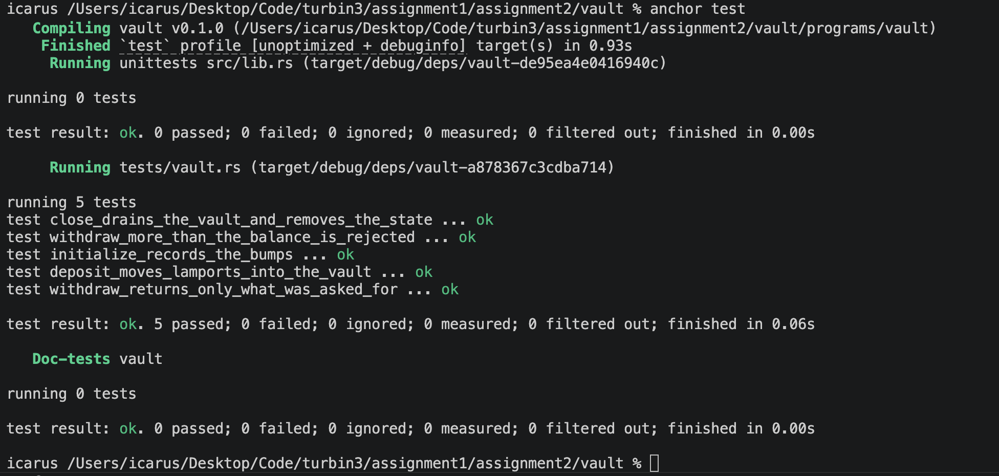
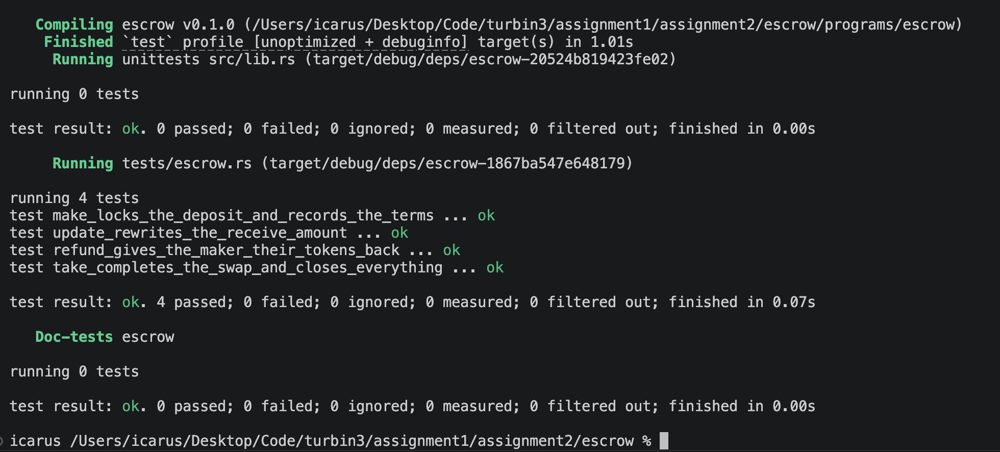
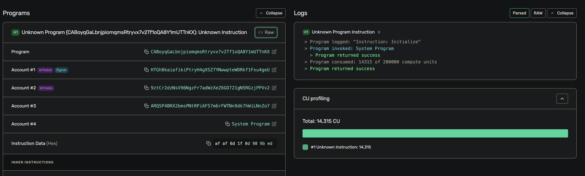
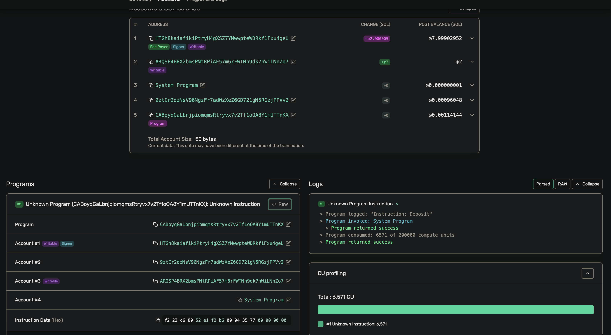
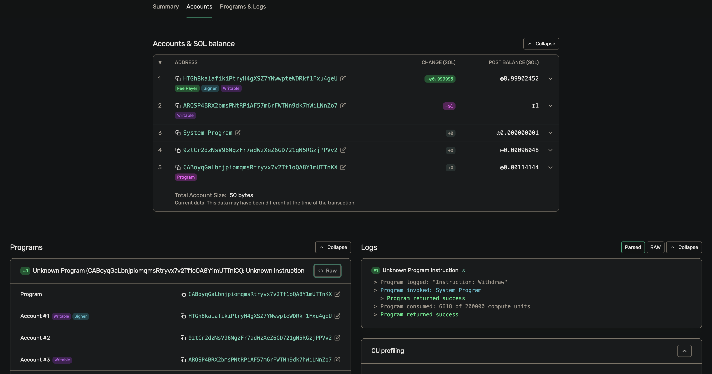
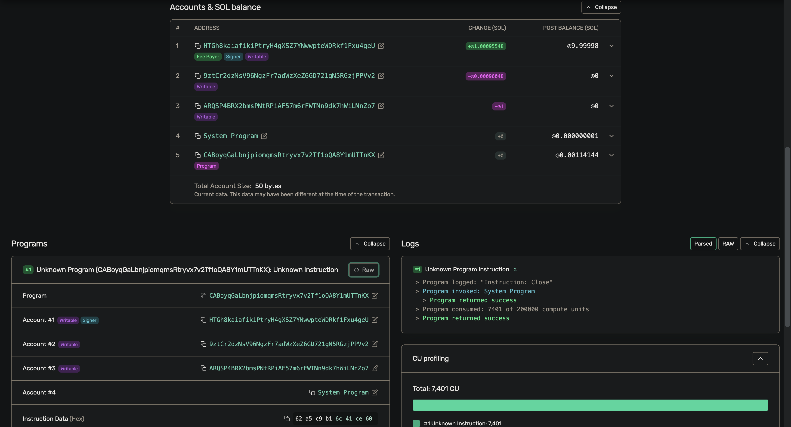
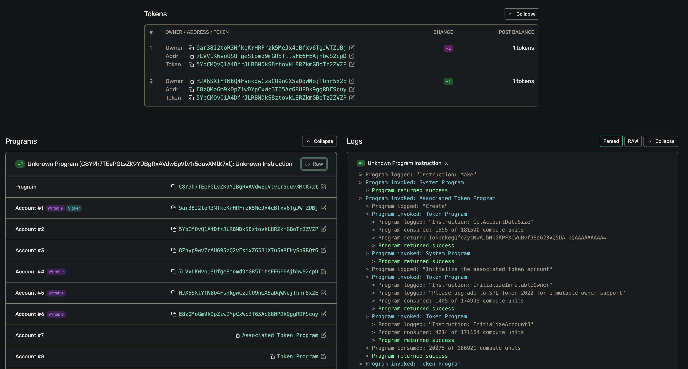
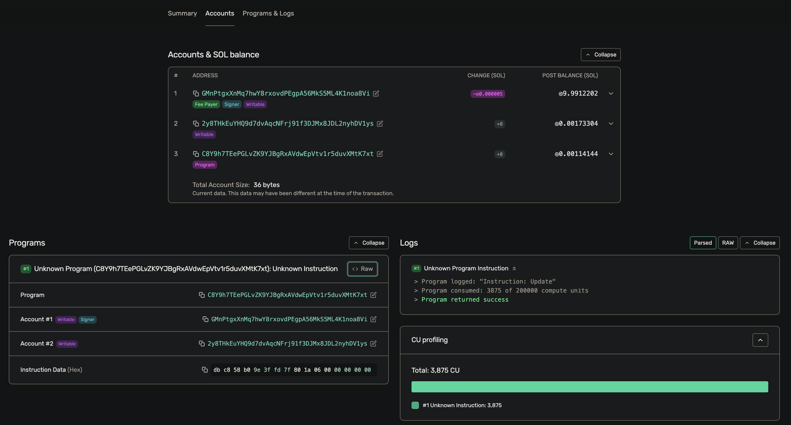
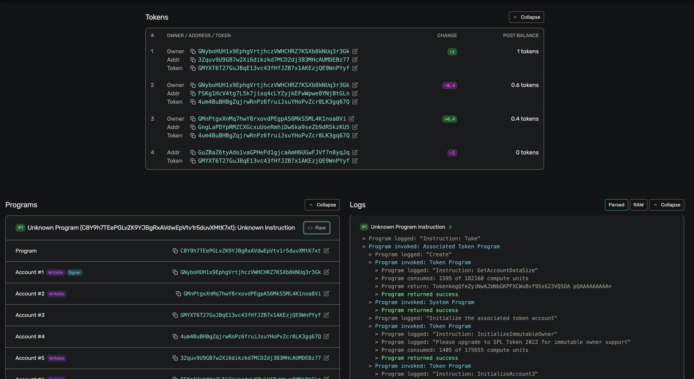
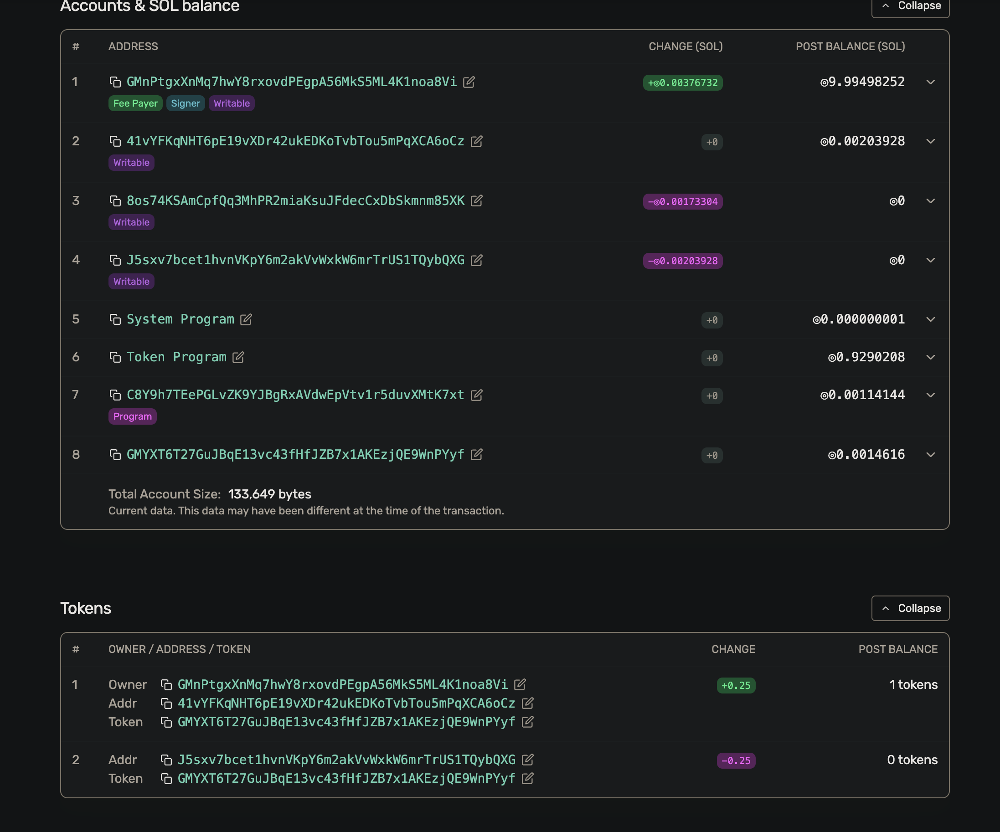

# Assignment 2 — Vault & Escrow

Two Anchor programs with LiteSVM test suite written in Rust.

## Tasks

1. Write the vault program and include the withdraw and close instructions. 
2. Write the escrow program with all instructions (make, take, refund, update). 
3. Write tests covering all the instructions using either Typescript or Rust using LiteSVM.

## Layout

```
assignment2/
├── vault/          # SOL vault: initialize, deposit, withdraw, close
├── escrow/         # SPL token escrow: make, take, update, refund
└── screenshots/          # cargo-test output + per-instruction Explorer captures
```

## Running the tests

Both suites are plain `cargo test` integration tests that load the compiled
`.so` into LiteSVM, so you need to build the program first and you do **not**
need a local validator or a devnet connection.

```bash
# vault
cd vault && anchor build && cargo test

# escrow
cd escrow && anchor build && cargo test
```

## Results

```
vault    5 passed; 0 failed   (initialize, deposit, withdraw, withdraw-too-much, close)
escrow   4 passed; 0 failed   (make, update, take, refund)
```




## Localnet demo (for Explorer screenshots)

Every instruction run as a real transaction against a local validator, viewed on
Solana Explorer (custom RPC = `http://localhost:8899`).

### Vault

**initialize**


**deposit**


**withdraw**


**close**


### Escrow

**make**


**update**


**take**


**refund**


 